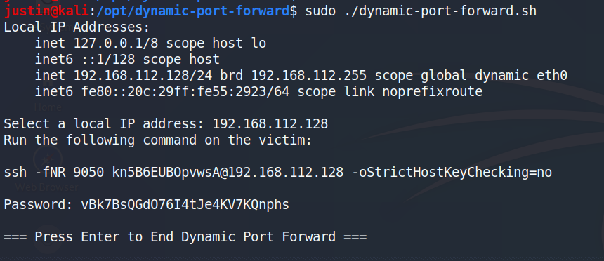
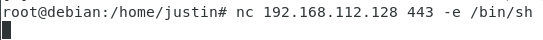
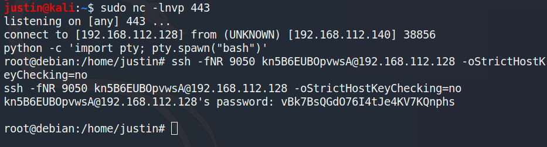
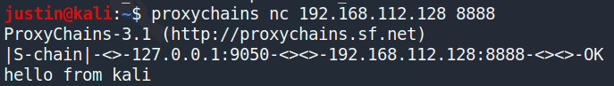
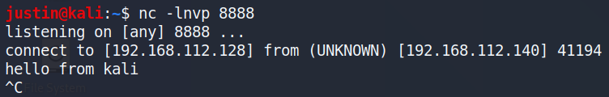
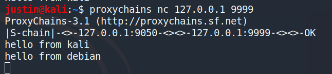
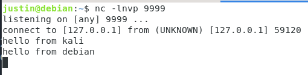
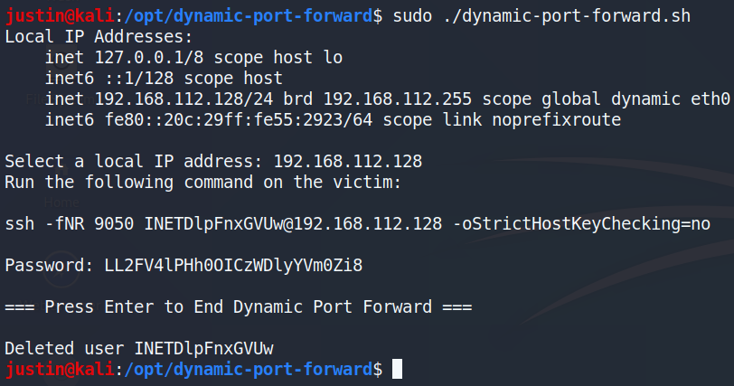

# reverse-dynamic-port-forward
This is a simple scriupt to make it easier to create reverse dynamic port forwards with SSH.

## Setup

Run the script on kali.

Create a reverse shell from the debian server to kali.

From the reverse shell, copy and paste the command generated by the script.

## Example 1: connections to kali will go through debian

## Example 2: connections to localhost will go to debian

## Cleanup

The script automatically kills all processes from the temporary user and then deletes it.

